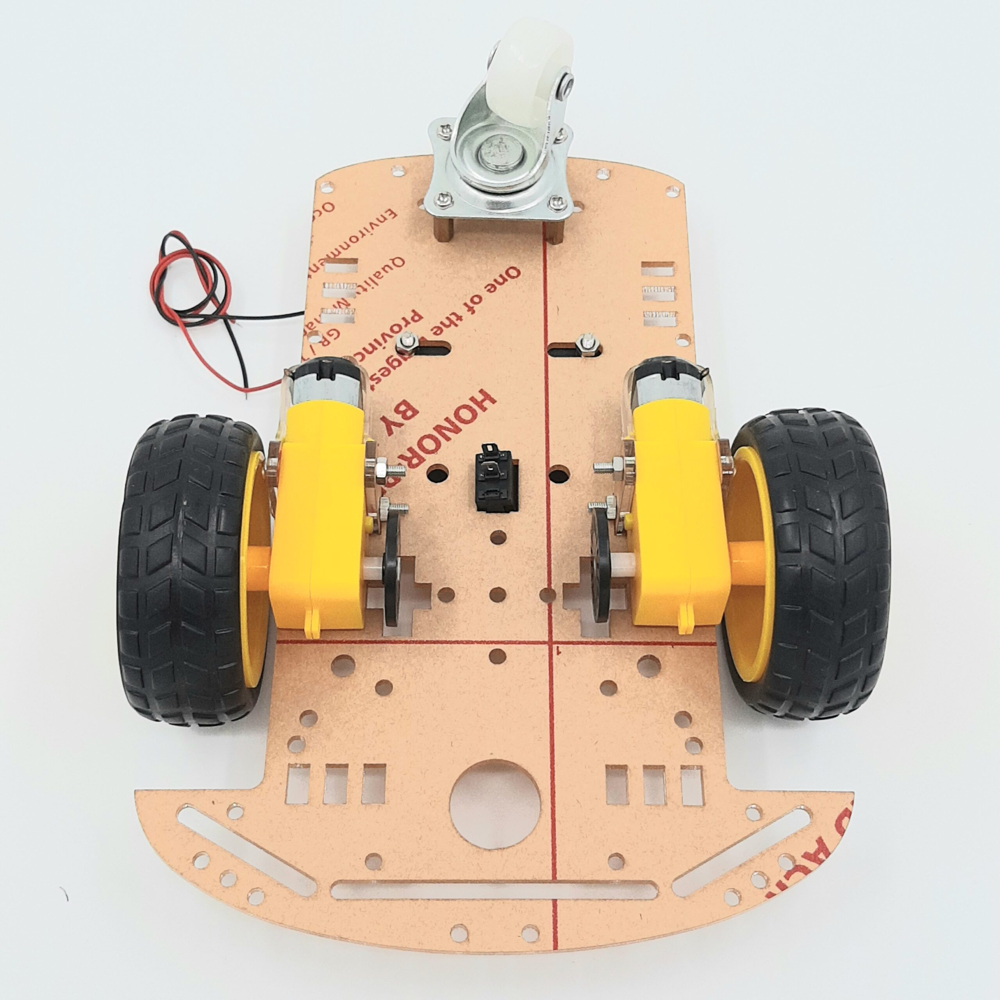
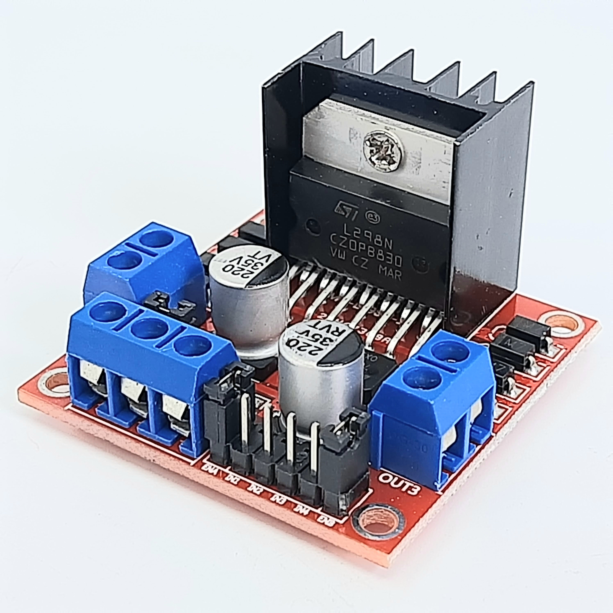

## Car for drawing pictures

### Functionality

This project was carried out during my time at university and involved programming a cart to perform movements and draw an image. The cart used for the project was similar to the one shown below. All of the cart's functions were programmed in assembly language and the project was developed for the Texas Instruments TM4C123GH6PM microcontroller.

The file Main.s configure the ports that in this case drives the inputs (buttons) and outputs (H-Bridge circuit). For this project i used pull-down resistors with the buttons. For the outputs there no was neccessity of using a particular circuito because i used a modul __DRIVER SHIELD L298N__ for two motors. 

El archivo Main.s maneja la configuración de los puertos (que se describen en el) y este llama posteriormente al archivo Read_Button.s que se encarga de leer los botones para saber cuál función realizar. Este último archivo tiene la funcionalidad de llamar a las funciones que dependiendo del botón que se presionó este realiza la acción (dibuja la figura). Las funciones para dibujar las figuras se encuentran en los archivos:

1. Funcion1.s
2. Funcion2.s
3. Funcion3.s
4. Funcion4.s

